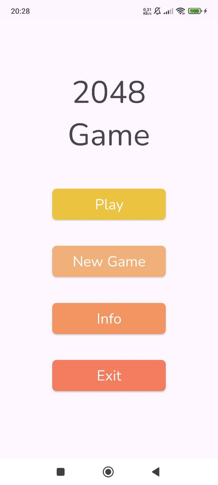
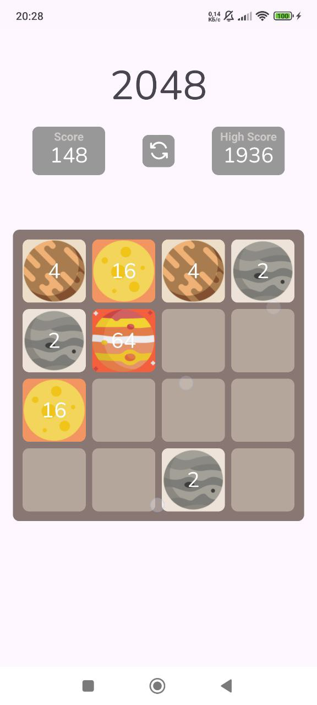
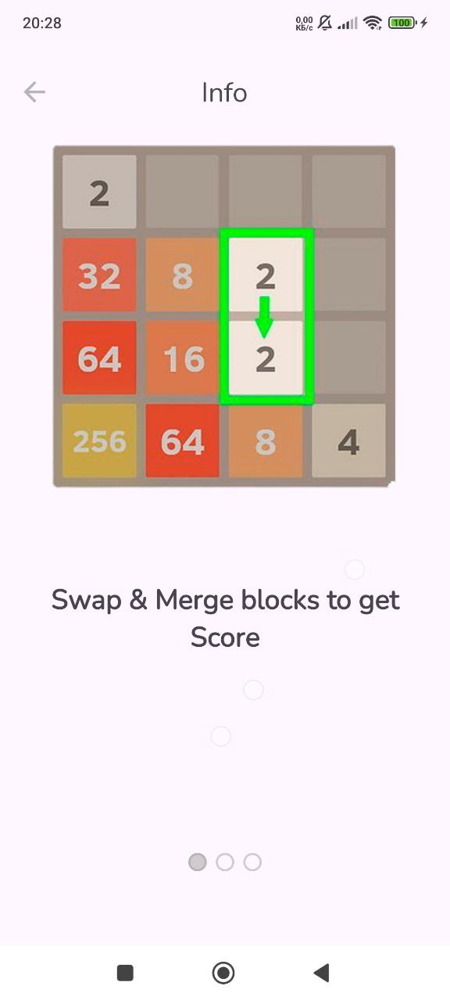
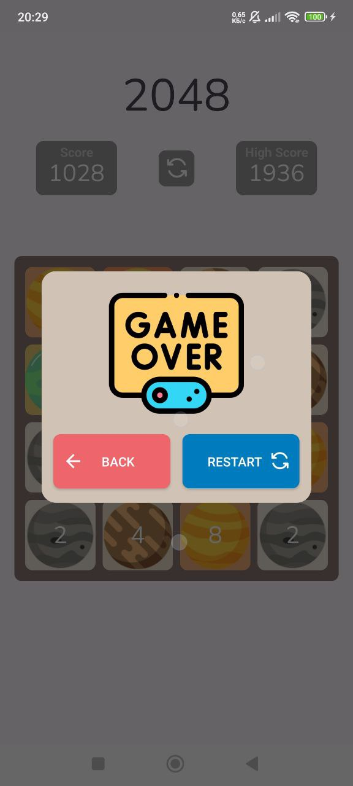

# 2048 Game - Android Native App

Welcome to the **2048 Game** repository! This is an Android implementation of the popular **2048 Game**. In this game, the player slides numbered tiles (cubes) on a grid to combine them and achieve higher results. The goal is to reach the tile numbered 2048 by strategically merging cubes. This app is built with **Android Native** using modern Android development practices like **MVVM** architecture, **Clean Architecture**, **Gesture Detectors**, and **LiveData**.

---

### 🎮 **Game Overview**

The **2048 Game** app offers a fun and addictive puzzle experience where players merge matching numbers to form larger numbers and try to achieve the coveted **2048** tile.

**Features**:
- **Slide Cubes**: Slide the numbered tiles in any direction (up, down, left, right) to merge matching tiles.
- **Achieve 2048**: Combine tiles to reach the 2048 tile.
- **Live Score**: Track your current score in real time.
- **Undo Moves**: Option to undo the previous move.
- **Swipe Gestures**: Use touch gestures to slide the tiles using a **GestureDetector**.
- **Persistent High Score**: Save your highest score locally using **SharedPreferences**.
- **Clean Architecture (MVVM)**: The game follows the **MVVM** (Model-View-ViewModel) design pattern and **Clean Architecture** principles to ensure the codebase is maintainable and scalable.

---

### 🚀 **Features**

- **Slide and Merge**: Use swipe gestures to slide cubes and combine matching numbers.
- **Game Mechanics**: The player aims to combine tiles to form larger numbers, starting with two "2" tiles.
- **Real-time Scoring**: The score updates dynamically as tiles merge.
- **Gesture Detection**: Tiles are moved using **GestureDetector** for smooth user interactions.
- **High Score Tracking**: Saves the highest score achieved using **SharedPreferences**.
- **Clean Architecture**: The game’s logic is structured into a maintainable architecture with **MVVM** and **LiveData** for state management.
- **Animations**: Smooth tile sliding animations to enhance the gameplay experience.
- **Undo Moves**: Revert to the previous game state with an undo feature (optional).

<table>
  <tr>
    <td></td>
    <td></td>
  </tr>
  <tr>
    <td></td>
    <td></td>
  </tr>
</table>